# Donation App | Blockchain Bootcamp

<p align="center">
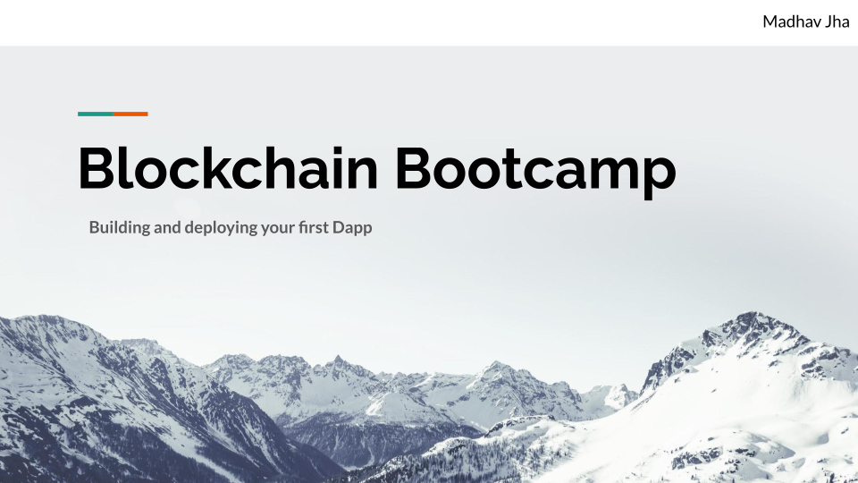
<br>
A blockchain based donation app, to make and track donations.
</p>

## Pre-requisite:

-  Install `NodeJS` in your machine: https://nodejs.org/en/download
-  Install `VScode` in your machine: https://code.visualstudio.com/download

## Installing a cryptocurrency wallet:

To utilize the benefits of blockchain first of all we need a `cryptocurrency wallet`, there are many available in the market such as `MetaMask`, `Coinbase`, `BitPay`, etc.

For this project we will install one of the most popular among them i.e. `MetaMask`

The steps are as follows:

1. Search for `MetaMask` in the [chrome webstore](https://chrome.google.com/webstore/category/extensions?hl=en)

<p align="center">
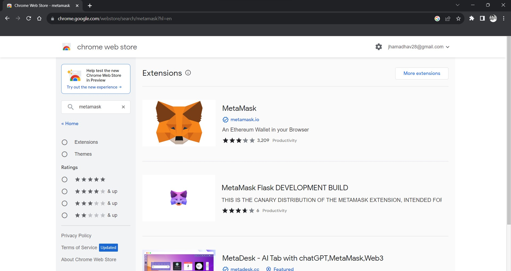
</p>

2. Install `MetaMask`:

<p align="center">
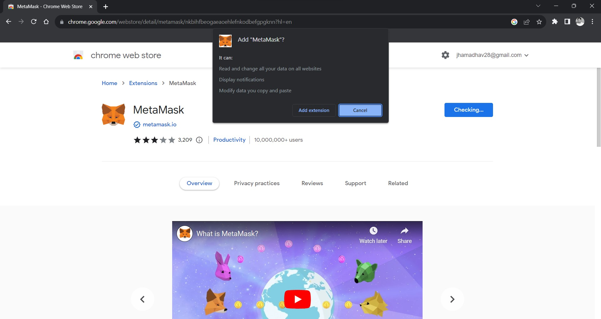
</p>

3. Create a new wallet:

<p align="center">
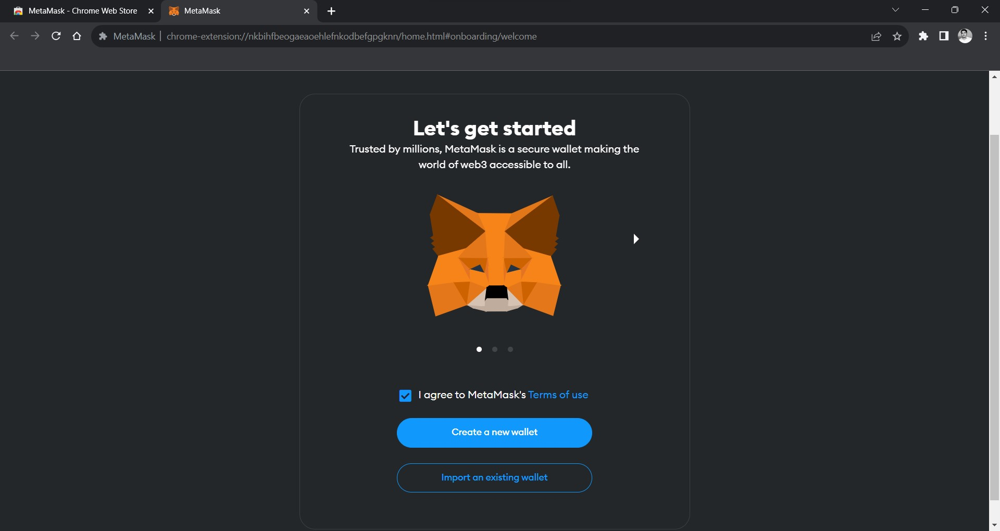
</p>

4. Here we have our crypto wallet: 🥳

<p align="center">
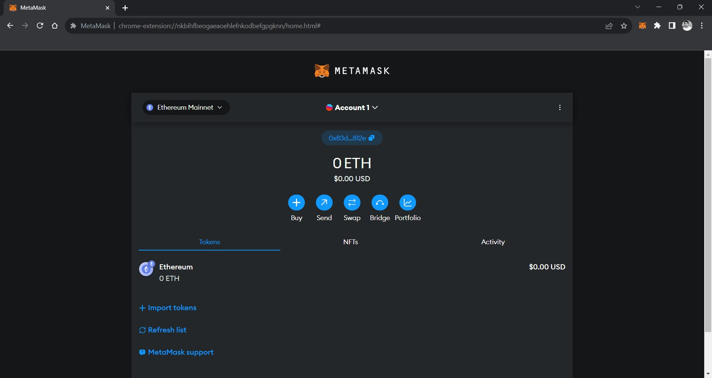
</p>

But as you may notice, we have no `funds` here 😔, and buying `Ethereum` could be quite expensive, so what can do we do ?

Let's install a local blockchain where we can test all our stuff.

## Installing Ganache:

1. Visit [Truffle Suite](https://trufflesuite.com/ganache/) to download `Ganache`

<p align="center">
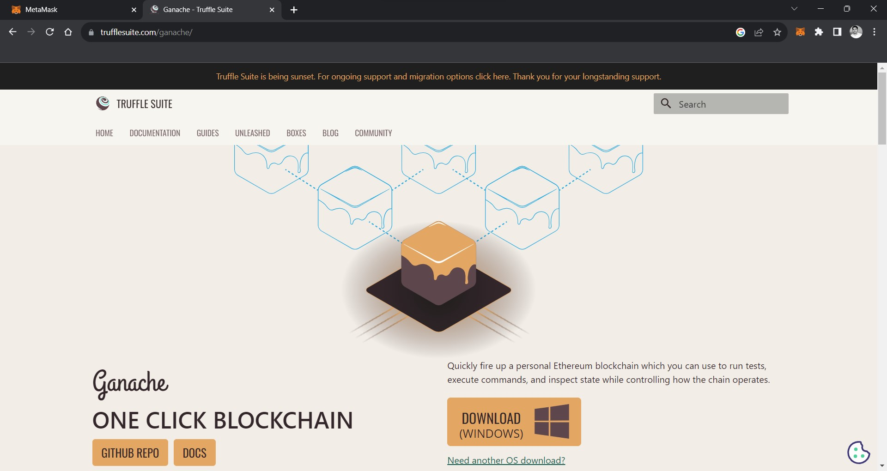
</p>

2. Create a new Workspace:

<p align="center">
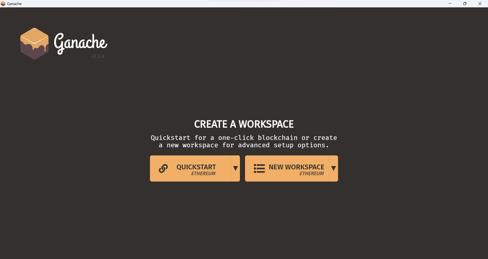
</p>

3. Here we have it, our own local blockchain: 🥳

<p align="center">
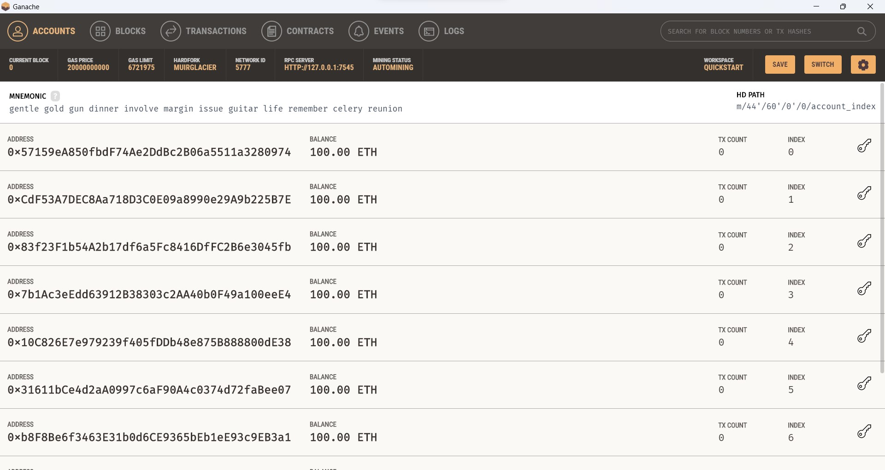
</p>

So as of now we have our `Crypto wallet` set up done, and our `Local Blockchain` setup done; but how do we connect these two ?

## Connecting Ganache account to MetaMask Wallet:

1. Click on the `MetaMask` extension and click `add new network`:
<p align="center">
   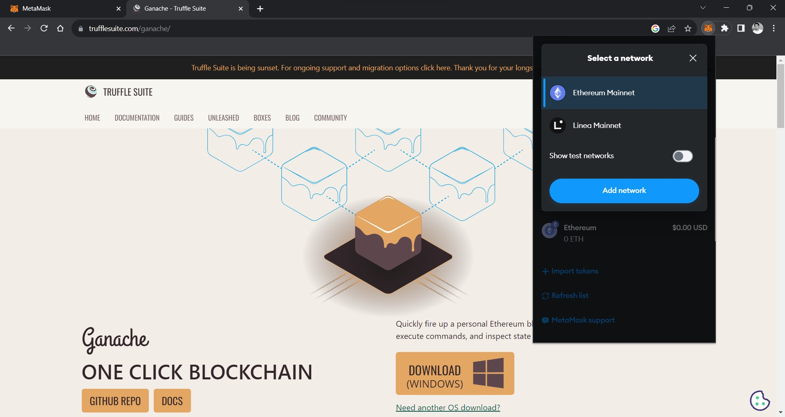
   </p>

2. Add the following details, like this:
<p align="center">
   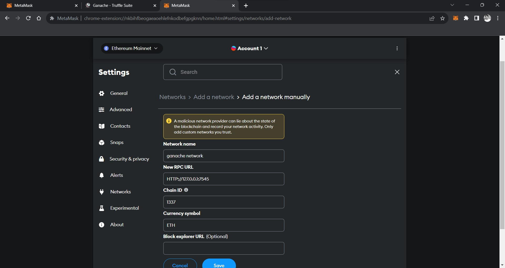
   </p>

3. And we are done with connecting our local blockchain to metamask wallet:
<p align="center">
   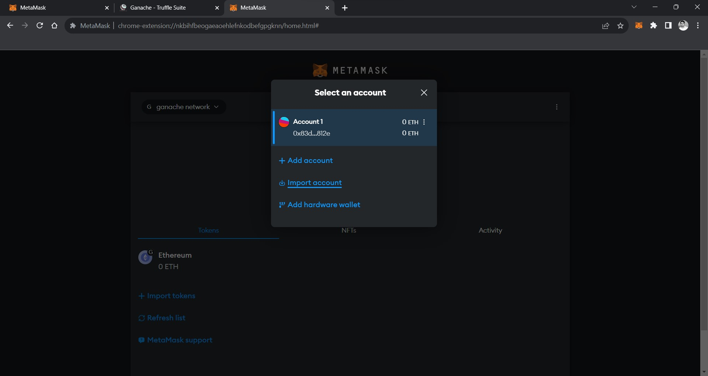
   </p>

4. Let's add an account from our chain to the metamask, so we can have the funds available,
Copy the private key from here.
<p align="center">
   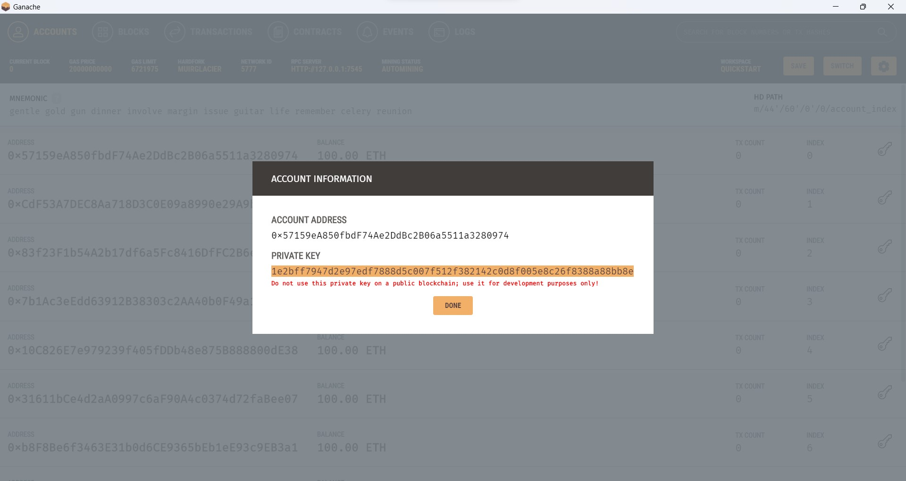
   </p>

5. Click `Import Account` in `MetaMask` extension:
<p align="center">
   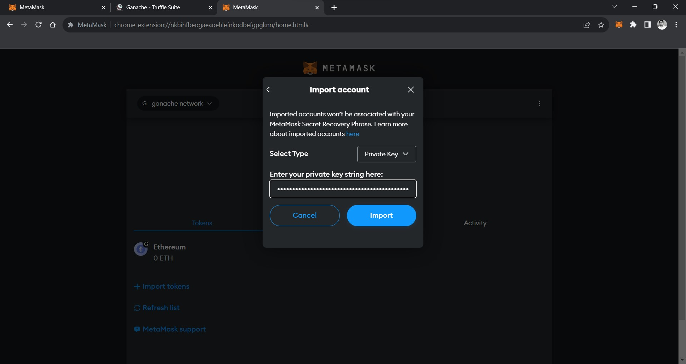
   </p>

6. 🥳 and we have our funds in our wallet (locally only though)
<p align="center">
   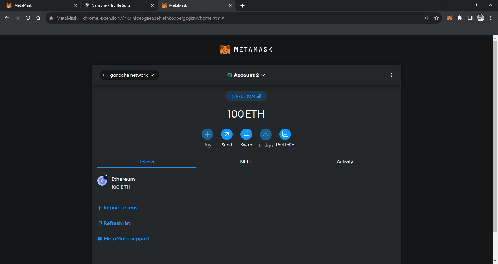
   </p>

With this we are ready to start developing our application.

## Donation App: Frontend

For our application frontend we will be using `HTML`, `SCSS/CSS`, and `JavaScript`. This is to make the application simple to build and easier for everyone to follow along.

You can create the frontend on your own or you can do the following.

1. Create `index.html`, and copy all the contents from the `index.html` available in the repository.
2. Create `/styles` folder and copy all the content from there.
3. Create `/scripts` folder and create `main.js` in that. Content in `main.js` for now should be the following:

```js
window.onload = async () => {
   hideLoader();
};
```

4. Now if you will open the `index.html` in browser we will have our frontend ready. 🥳

## Solidity contract: Donation App backend logic

Now that our Frontend is ready let's make our blockchain contract to execute our application logics.

-  Create `contact` folder with file `1_DonationContract.sol`.
-  Copy `truffle-config.js` file as well, this will help us deploy the contract to our ganache local blockchain.

We need 3 essentials logics, and there code is as follows:

1. Creating a donation

```solidity
function create(string memory id, string memory time, uint256 amount) public {
    Donation memory a;
    a.id = id;
    a.time = time;
    a.amount = amount;
    a.userAddress = msg.sender;

    donations[id] = a;
    allDonations.push(id);
}
```

2. Fetching a donation by ID

```solidity
function getDonation(string memory id) public view returns (Donation memory) {
    return donations[id];
}
```

3. Fetching all donations

```solidity
function getAllDonations() public view returns(string[] memory){
    return allDonations;
}
```

Finally the contract will look like this:

```solidity
// SPDX-License-Identifier: GPL-3.0
pragma solidity >=0.8.0 <0.9.0;

contract DonationContract {
    struct Donation {
        string id;
        address userAddress;
        string time;
        uint256 amount;
    }

    mapping(string => Donation) public donations;
    string[] allDonations;

    function create(
        string memory id,
        string memory time,
        uint256 amount
    ) public {
        Donation memory a;
        a.id = id;
        a.time = time;
        a.amount = amount;
        a.userAddress = msg.sender;

        donations[id] = a;

        allDonations.push(id);
    }


    // function to view appication
    function getDonation(string memory id) public view returns (Donation memory) {
        return donations[id];
    }

    function getAllDonations() public view returns(string[] memory){
        return allDonations;
    }
}
```

we can test our contract on [Remix - Ethereum IDE](https://remix.ethereum.org/#lang=en&optimize=false&runs=200&evmVersion=null).

## Deploying to Ganache:

-  Copy the `migrations` folder to your root folder

1. Open your `VSCODE` terminal and run the following:
   -  `npm init`
   -  `npx truffle build`

This will compile the contract that we have created and make this file `DonationContract.json`, this contains the details of our contract that are needed to deploy it to the block chain.

2. Run `npx truffle deploy`

This will deploy our contract to the chain.

3. Move to `Ganache`, navigate to `Contracts`, and you can see the address of the contract block:
<p align="center">
   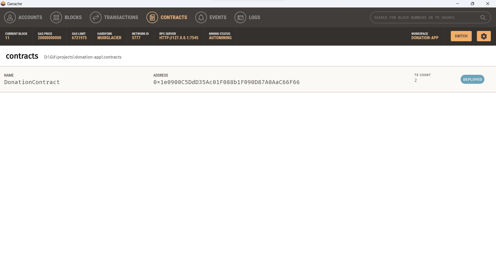
   </p>

Copy this address this will come in handy.

Now that we have our `Frontend` and `Backend` ready, let's connect them.

## Integrating `Frontend` and `Backend`:

1. From `scripts` folder, copy `contractConfig.js` and `contractProxy.js`
2. In the config file, we have the `abi` that we got from `truffle compile` in the file `DonationContract.json`, and we have the contract's first block address that you have noted before:

`contractConfig.js`:

```js
// contract creation block address details

// first block address
const contractAddress = "Address that you copied";

// first block abi
const abi = [...] // copy from `DonationContract.json`

```

3. Now that we have means to connect to our `blockchain`, let's create functions to do so.
4. We essentially need these 4 functions:

   1. Connect()

   ```js
    async connect() {
      this.provider = new ethers.providers.Web3Provider(window.ethereum);
      await this.provider.send("eth_requestAccounts", []);
      this.signer = this.provider.getSigner();
      this.contract = new ethers.Contract(contractAddress, abi, this.signer);
      this.isConnected = this.provider && this.signer && this.contract;
      await this.getAccount();
   }
   ```

   2. createDonation()

   ```js
    async createDonation(amount) {
      if (!this.isConnected) {
         console.log("Connect Your Account to Continue!");
         return [];
      }
      let d = new Date();
      let data = {
         id: uuid(),
         time: d.toJSON().toString(),
         amount,
      };
      const tx = await this.contract.functions.create(
         data.id,
         data.time,
         data.amount
      );
      const receipt = await tx.wait();
      // console.log(receipt);
    }
   ```

   3. getDonationByID()

   ```js
    async getDonationByID(id) {
      if (!this.isConnected) {
         console.log("Connect Your Account to Continue!");
         return [];
      }
      const tx = await this.contract.functions.getDonation(id);
      return tx[0];
   }
   ```

   4. getAllDonationsID()

   ```js
    async getAllDonationsID() {
      if (!this.isConnected) {
         console.log("Connect Your Account to Continue!");
         return [];
      }

      const tx = await this.contract.functions.getAllDonations();
      return tx[0];
   }
   ```

5. Finally our `proxy` code will look like this:

```js
class ContractProxy {
   provider = null;
   contract = null;
   signer = null;
   isConnected = false;
   account = { address: "", balance: "" };

   async connect() {...}

   async createDonation(amount) {...}

   async getDonationByID(id) {...}

   async getAllDonationsID() {...}
}

```

Now that we are done with creating the proxy, copy all the code from `main.js`, this essentially have functions to interact with the Frontend and access the functions that we have created in proxy.

## Testing our application:

1. Enter `amount` that you want to donate, and click `donate`:
<p align="center">
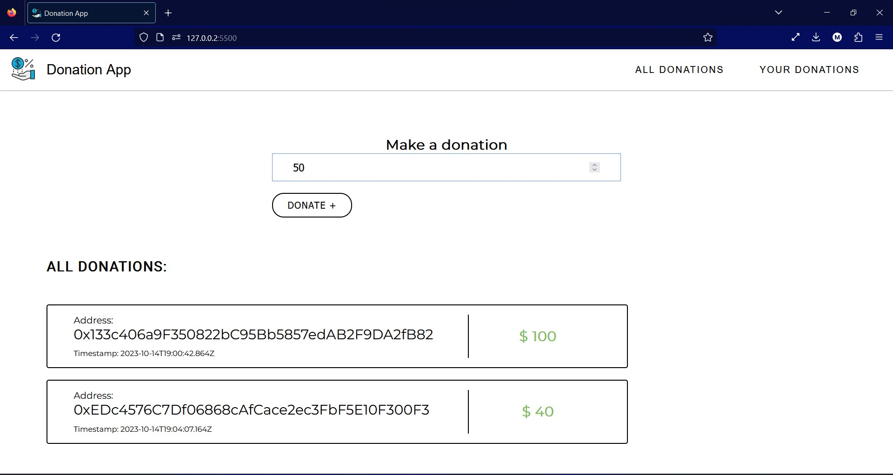
</p>

2. Pay `gas` to make the transaction happen:
<p align="center">
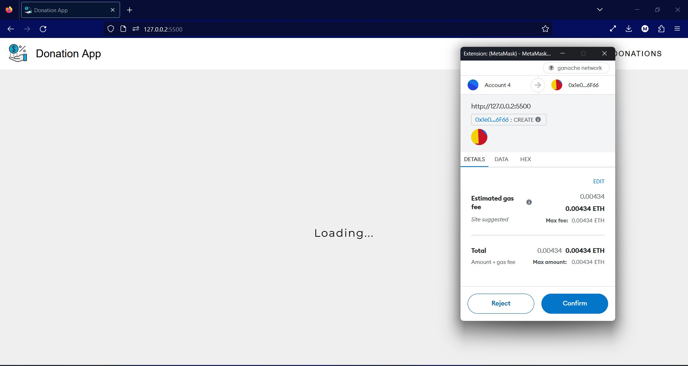
</p>

3. You can see `All Donations made`:
<p align="center">
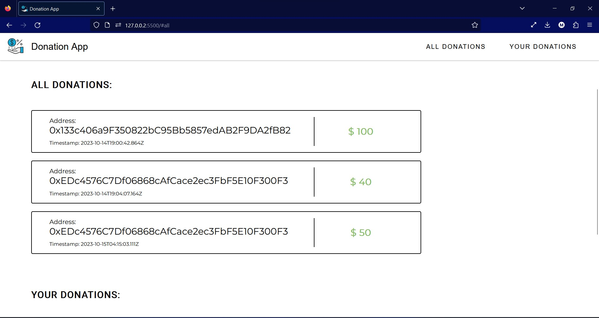
</p>

4. You can see `All Your Donations`:
<p align="center">
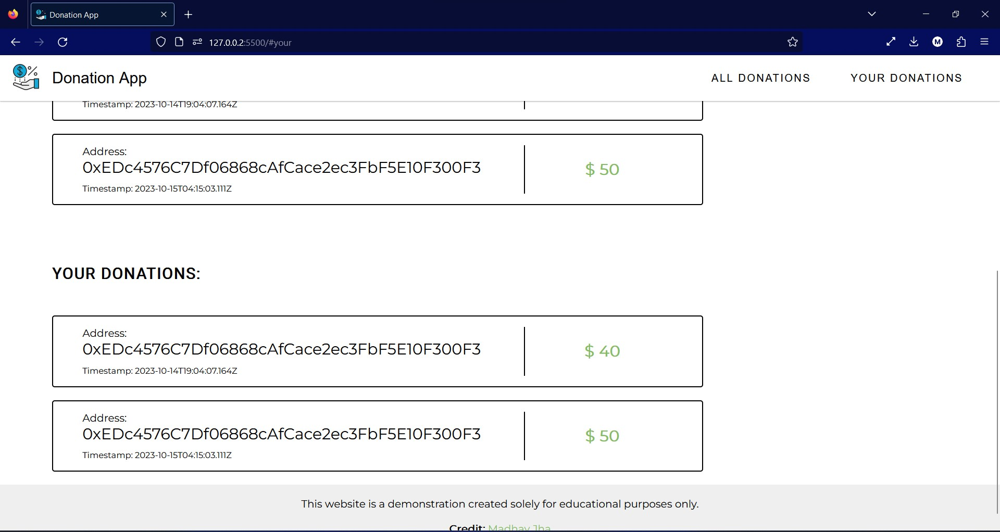
</p>

With this we can made our very first `Decentralized Application (Dapp)` 🥳

But this is only locally 😔, how can I show this to my friends ?

So let's learn how we can deploy it to a testnet and share it with our friends.

## Connecting to Polygon Mumbai Testnet:

1. Similar to how we added `Ganache` local network to our `MetaMask`, we need to add `Polygon Mumbai Testnet` to our `MetaMask` wallet as well.
2. Add the following details:
<p align="center">
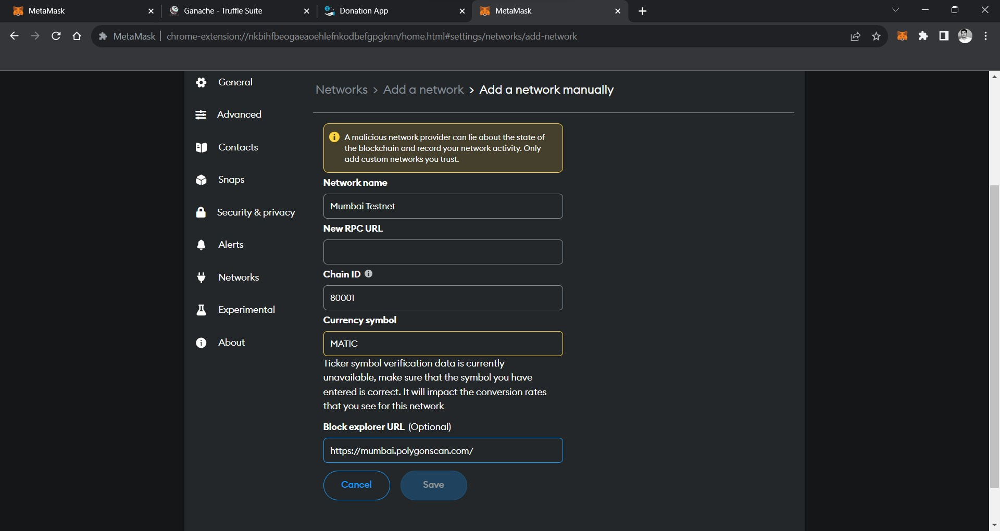
</p>
3. We will get the `RPC` link from [Alchemy](https://www.alchemy.com/), create `app` here.
<p align="center">
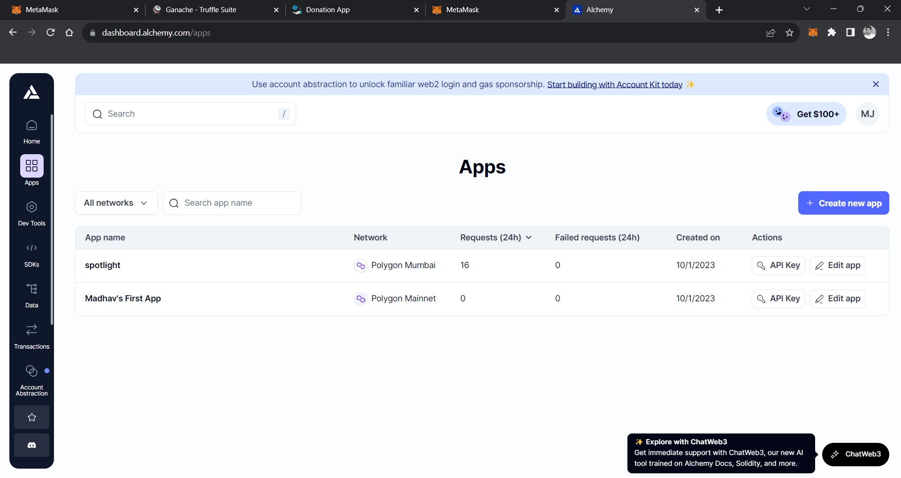
</p>
4. Add application details
<p align="center">
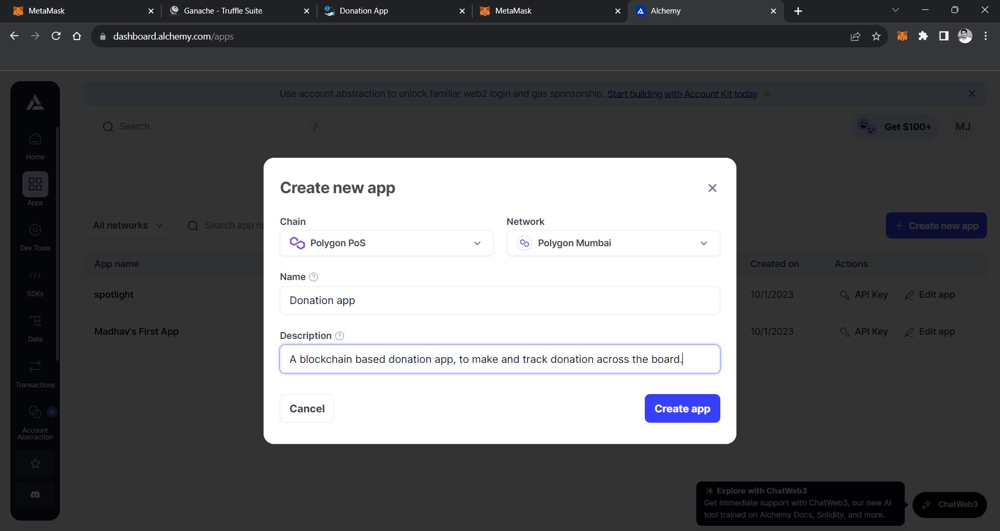
</p>
5. Copy the `api key`, this will be our `RPC` link
<p align="center">
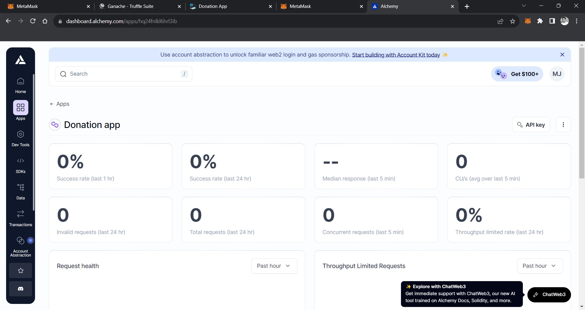
</p>

6. Paste this to the network settings, and we are done:
<p align="center">
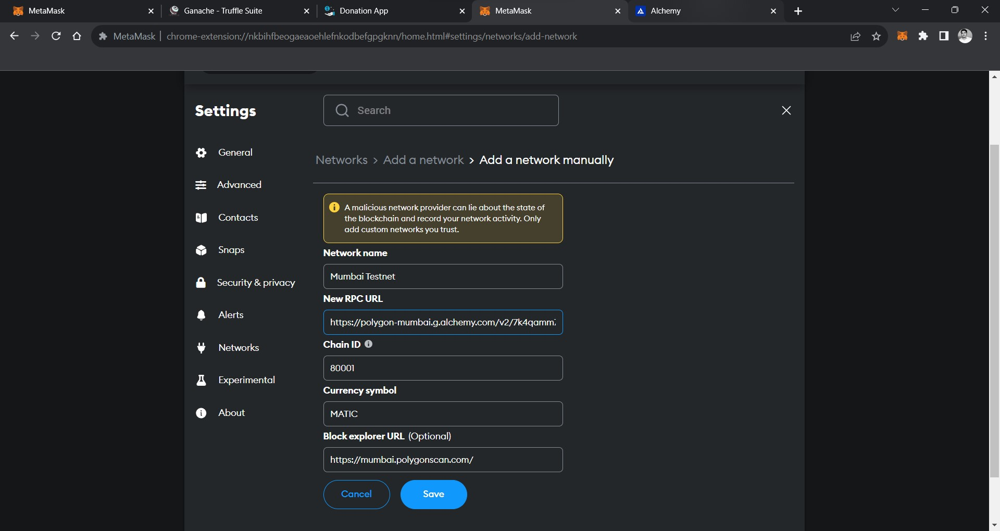
</p>

7. Now you might notice, we run run into a similar problem, we have no funds 😔,so we will use the [Faucet](https://mumbaifaucet.com/) to get few `Matic` (currency used in polygon). Just enter your account address and you will receive `1 Matic`, this will be enough do host and do our testings.
<p align="center">
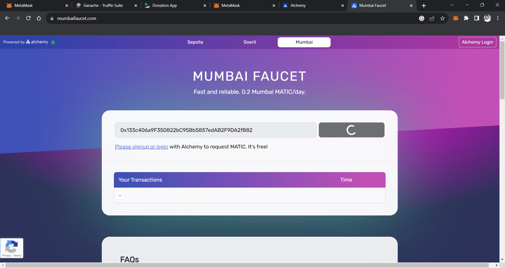
</p>

Now that we are done with setup of our `Test Net Chain`, let's deploy our contract there.

## Deployment:

1. Open [`Remix - Ethereum IDE`](https://remix.ethereum.org/), paste your contract there and compile it.

       -  After that select `Injected Provider - MetaMask` as environment and deploy.
       -  Copy the `Contract address`, and paste to the `contractConfig.js` that we have.

   <p align="center">
   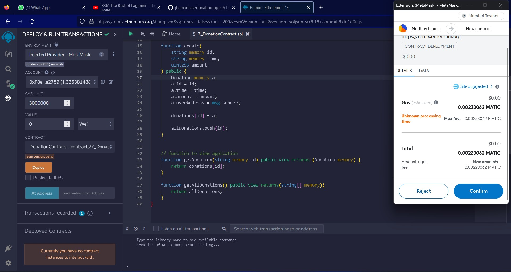
   </p>

2. With this we have connected out `Frontend` to our `Test Net Backend`.

With this we are done 🥳🥳

## Conclusion:

We have now acquired the knowledge to develop a fundamental blockchain-based application, conducted testing on our local blockchain network, and successfully hosted it on the Polygon Mumbai testnet. I trust you enjoyed the process as much as I did. If you have any questions or concerns, please don't hesitate to reach out to me.

## My Socials:

-  Mail: contact@jhamadhav.com
-  Linkedin: [@jhamadhav](https://www.linkedin.com/in/jhamadhav)
-  Twitter: [@jhamadhav28](https://twitter.com/jhamadhav28)
-  Website: [jhamadhav.com](https://jhamadhav.com/)
